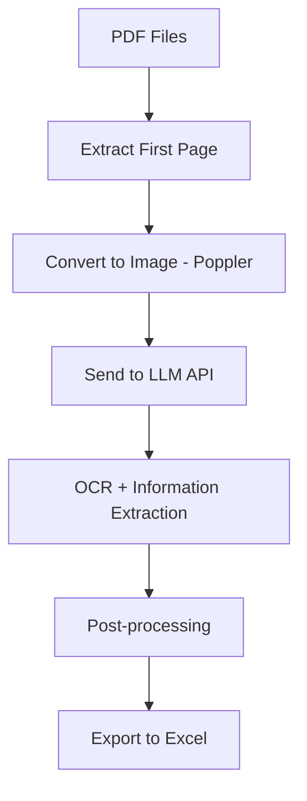

# 📄 Administrative Document OCR Tool


> 🚀 A personal learning project to extract key information from scanned administrative PDF documents using AI-powered OCR.

---

## 🙋 About This Project

This project was built as part of my journey learning Python and working with AI models.

The goal is simple:
- Automate the extraction of structured information from scanned administrative documents  
- Experiment with LLM-based OCR instead of traditional OCR engines  

⚠️ As a beginner project, the code may not be perfect — but it works, and I’m continuously improving it.

---

## 🧠 How It Works



---

## ✨ Features

- 📄 Process scanned PDF documents  
- 🖼️ Extract first page as image  
- 🤖 Use LLM API for OCR + structured extraction  
- 📊 Export results to Excel  
- 🖥️ Simple GUI for easy usage  

---

## 🏗️ Project Structure

```
.
├── AI Trích xuất VB.bat  # main launcher
├── Setup.bat             # install libs
├── data/
│   ├── app3.py           # GUI
│   ├── main_v4.py        # AI process
│   ├── pdf2img.py        # PDF process
│   ├── poppler/          # Poppler lib
│   └── requirements.txt
├── output/               # extracted-image
└── pdf/                  # source PDFs
└── README.md
```

---

## ⚙️ Installation

### 1. Setup Poppler

Extract `poppler.rar` into:

```
~./data
```

### 2. Install Dependencies

Run:

```
Setup.bat
```

---

## ▶️ Usage

Run the tool:

```
AI Trích xuất VB.bat
```

📌 Instructions are available inside the GUI.

---

## 🔧 API Configuration (IMPORTANT)

Before using the tool, please update the API endpoint in the code.

Example:

```python
OLLAMA_URL = "http://127.0.0.1:11434/v1/chat/completions"
MODEL_NAME = "qwen3-vl:4b"
```

---

## ⚠️ Limitations

- Designed mainly for Vietnamese administrative documents  
- Accuracy depends on image quality and model performance  
- Only processes the first page  

---

## 📚 What I Learned

- Working with PDF → Image pipelines  
- Calling LLM APIs  
- Structuring data  
- Building automation tools  

---

## 🧩 Future Improvements

- Multi-page support  
- Better parsing  
- Local OCR fallback  
- Improved UI  

---

## 🤝 Contributions & Feedback

I’m still learning, so feedback is highly appreciated.

---

## ⭐ Support

If you find this useful, feel free to give it a ⭐
